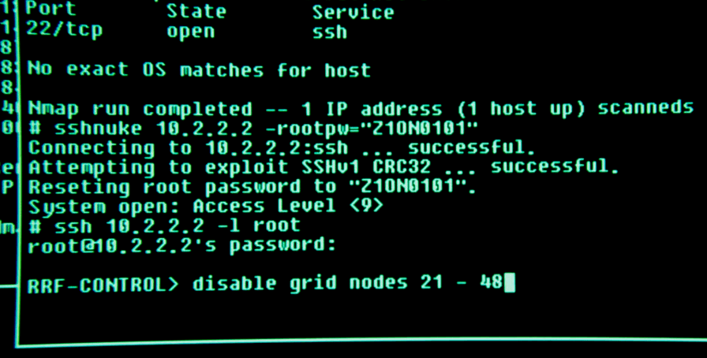
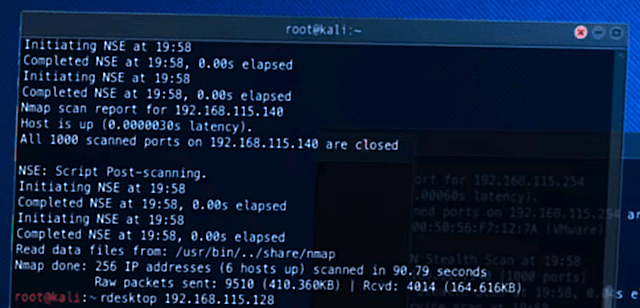

## scan



> You're going to do like Trinity in the movie _The Matrix Reloaded_. Except that you're not going to turn off the electricity in a city, and you probably don't wear as much leather, but that's okay.

---

By design and by default, most network entities have a high discoverability.

Whatever your motivations for exploring a network (hacking, curiosity...), you generally proceed in this order :

1. Scan a network to find hosts
2. Scan a host to get information (hardware, OS & exposed services)

`1.` can be done by analyzing the link layer of Internet protocols, in particular `ARP` in order to gather MAC addresses (the identifier of a network interface, such as Wi-Fi or Ethernet cards).

`2.` is usually performed by analyzing the network and transport layers, in particular the `IP` & `TCP` protocols with the `nmap` tool.

For the context, when you open a website, here are the protocols involved, from the highest to lowest level (the protocols at the top depend on those at the bottom):

- `HTTP`: application layer (website data) - messages
- `TLS`: application layer ("lock" sign) - secure connection
- `TCP`: transport layer (port number) - reliable connection
- `IP`: network layer (IP address) - global communication
- `ARP`: link layer (MAC address) - local communication

For this challenge, you will focus on `IP`, `ARP` & `TCP`, and therefore on IP/MAC addresses and ports.

You will need to add these 2 VMs:

### For VirtualBox

- [01_scan_RRF-CONTROL](https://assets.01-edu.org/sys/01_scan_RRF-CONTROL.tar.gz)
- [01_scan_laptop](https://assets.01-edu.org/sys/01_scan_laptop.tar.gz)

### For UTM

- [01_scan_RRF-CONTROL](https://assets.01-edu.org/sys/01_scan_RRF-CONTROL.utm.zip)
- [01_scan_laptop](https://assets.01-edu.org/sys/01_scan_laptop.utm.zip)

To perform your tasks you only need to use the two VMs.

You will only have control over "01_scan_laptop". A port forwarding is set on 10122 so you can connect through SSH, the password is a single space.

Your mission, should you choose to accept it, is to scan the network interface (`enp0s8` for VirtualBox,  `enp0s1` for UTM) and find a way in the server "01_scan_RRF-CONTROL", you will know you have succeeded when you see :

```
RRF-CONTROL> █
```

Because the virtualized Network is very slow (10 Mbps, Ethernet is usually 1000 Mbps), expect long scan times :

- ARP scanning takes up to 5 minutes
- port scanning takes up to half an one hour with the option `-T4` (even more without).

May the Fourth be with you.

---

---



> Another depiction of the `nmap` tool: in _Ocean's 8_, Rihanna uses [Kali Linux](https://www.kali.org) to steal a valuable diamond.
>
> Same strategy, different styles


SOLUTION:
## Objective
The mission was to navigate a virtualized network environment from a controlled host (**01_scan_laptop**) to gain access to a remote server (**01_scan_RRF-CONTROL**) by identifying its network presence, discovering open services, and utilizing credentials hidden within the mission briefing.

---

## Phase 1: Accessing the Launchpad (Laptop VM)
The operation began by connecting to the local laptop via a pre-configured SSH tunnel.

- **Command:** `ssh user@localhost -p 10122`
- **Authentication:** Per the briefing, the password used was a **single space**.
- **Local Recon:** Running `ip a` identified the network interface (`enp0s8` or `enp0s1`) and revealed the local subnet (e.g., `192.168.23.0/24`).

---

## Phase 2: Host Discovery (Link Layer)
Since the network was slow (10 Mbps) and entities were discoverable by design, **ARP (Address Resolution Protocol)** was used to map the local segment.

- **Methodology:** Analyzing the Link Layer to gather MAC addresses and associated IPs.
- **Command:** `sudo nmap -sn -PR 192.168.23.0/24`
- **Result:** Discovery of the target IP: `192.168.23.42`.

---

## Phase 3: Service Enumeration (Transport Layer)
With the target IP identified, a search for "open doors" was conducted at the Transport Layer using **TCP**.

- **Discovery Scan:** Due to the network speed, a targeted scan was performed to find open ports.
- **Full Port Scan:** `nmap -p- -T4 192.168.23.42`
- **Identification:** Port **4223** was found in the `OPEN` state.
- **Service Fingerprinting:** `nmap -p 4223 -sV 192.168.23.42` confirmed the service was `OpenSSH 7.9p1`.

---

## Phase 4: Final Breach (Application Layer)
The final step involved an SSH connection to the discovered port. Access required careful analysis of the "Subject" and the provided images.

- **Connection Command:** `ssh root@192.168.23.42 -p 4223`
- **Credential Recovery:** - The briefing referenced *The Matrix Reloaded* and Trinity's hack.
  - Close inspection of `scan1.png` revealed the root password used by Trinity.
  - By accounting for common character substitutions (using 'O' instead of '0'), the correct credentials were recovered.

---

## Conclusion
Upon successful authentication, the system prompt changed, signifying control over the grid:

```text
RRF-CONTROL> █